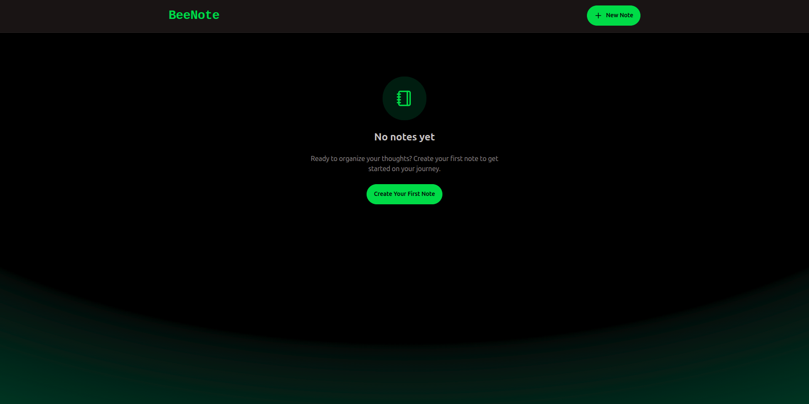
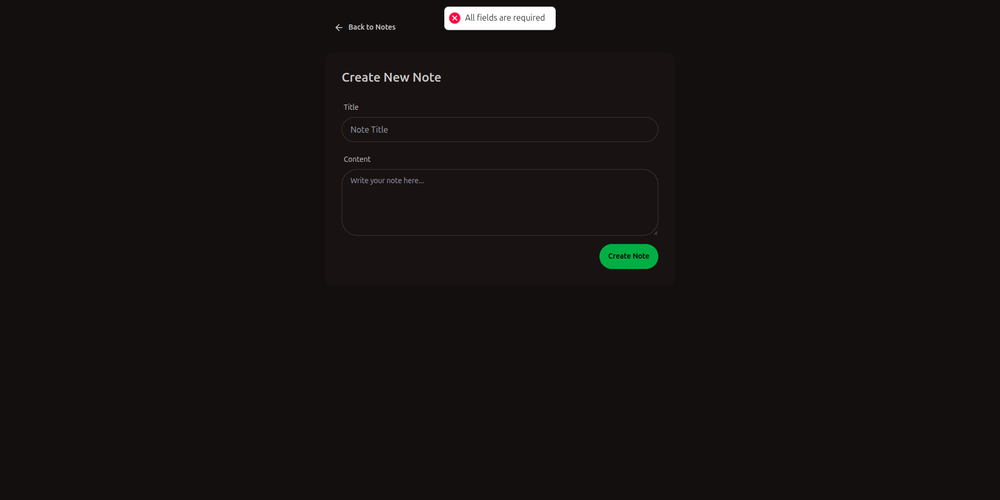
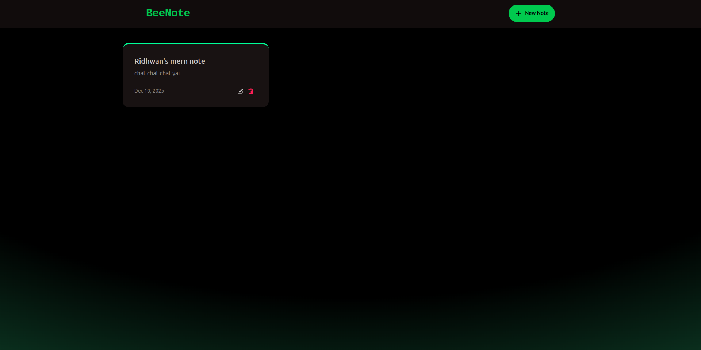

# 🐝 BeeNote: Secure & Scalable MERN Note-Taking App

<p align="center">
  
  
  
  
  
</p>

A high-performance, full-stack note application built with the **MERN** stack, emphasizing a smooth user experience and essential API security through rate limiting.

## ✨ Features & Highlights

| Feature | Description | Reference |
| :--- | :--- | :--- |
| **Robust CRUD API** | Standard RESTful endpoints allow for comprehensive management of notes, with results sorted descending by creation time. | `backend/src/controllers/notesController.js` |
| **Sliding Window Rate Limiter** | Prevents API abuse by limiting clients to **100 requests per 60 seconds** across all endpoints, implemented using `@upstash/ratelimit`. | `backend/src/middleware/rateLimiter.js` |
| **Dynamic UI & UX** | Built with **React** and **Vite**, featuring modern styling via **Tailwind CSS** and the high-contrast `forest` theme from **DaisyUI**. | `frontend/src/pages/HomePage.jsx` |
| **Error Handling** | Dedicated client-side component and logic to display a clear visual warning when the backend responds with a **429 (Too Many Requests)** status. | `frontend/src/components/RateLimitedUI.jsx` |
| **Simplified Workflow**| The root `package.json` includes scripts for a one-step installation/build process and a single command to start the production server. | `package.json` |

## 📸 Application Views

| Empty Home Screen | Create New Note | Home Screen with Data |
| :---: | :---: | :---: |
|  |  |  |

## ⚙️ Local Development Setup

### Prerequisites
* **Node.js** (LTS recommended)
* **MongoDB URI** for database connection (e.g., MongoDB Atlas).
* **Upstash Redis** REST URL and Token for rate limiting.

### Installation

1.  **Clone the Repository:**
    ```bash
    git clone your-repo-url
    cd mern-beenote
    ```
2.  **Setup Environment:** Create a **`.env`** file inside the `backend/` directory with your credentials:
    ```bash
    # backend/.env
    MONGO_URI="your_mongodb_connection_string"
    UPSTASH_REDIS_REST_URL="your_upstash_redis_url"
    UPSTASH_REDIS_REST_TOKEN="your_upstash_redis_token"
    NODE_ENV=development # Used for CORS and API base URL
    PORT=5001
    ```

### Running Locally

Use separate terminals to run the backend API and the frontend client simultaneously:

**1. Start the Backend API (with hot-reloading for development)**
```bash
cd backend
npm run dev
# Server started on PORT: 5001
```
**2. Start the Frontend Client (Vite development server) **
```bash
cd frontend
npm run dev
# Client available at http://localhost:5173
```


